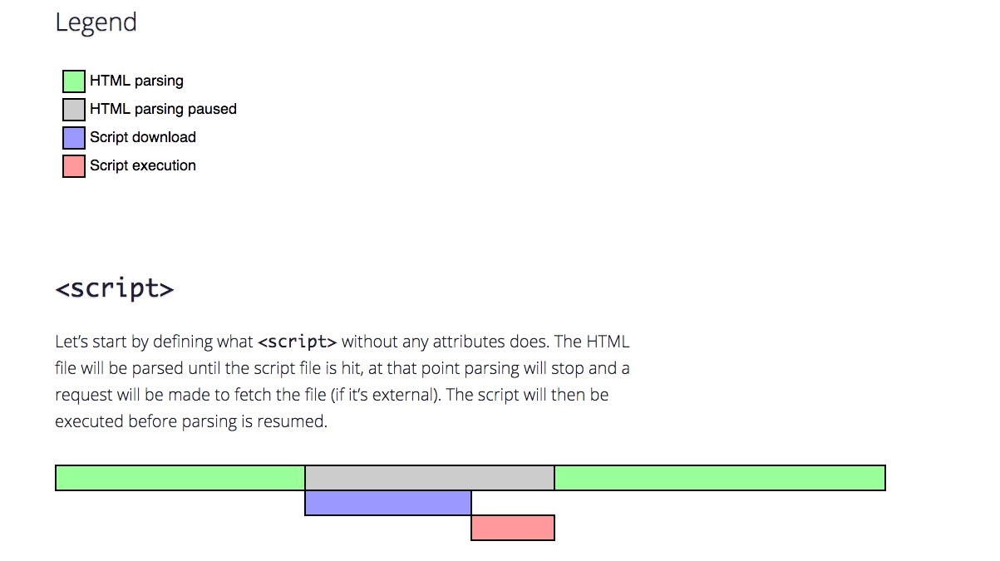
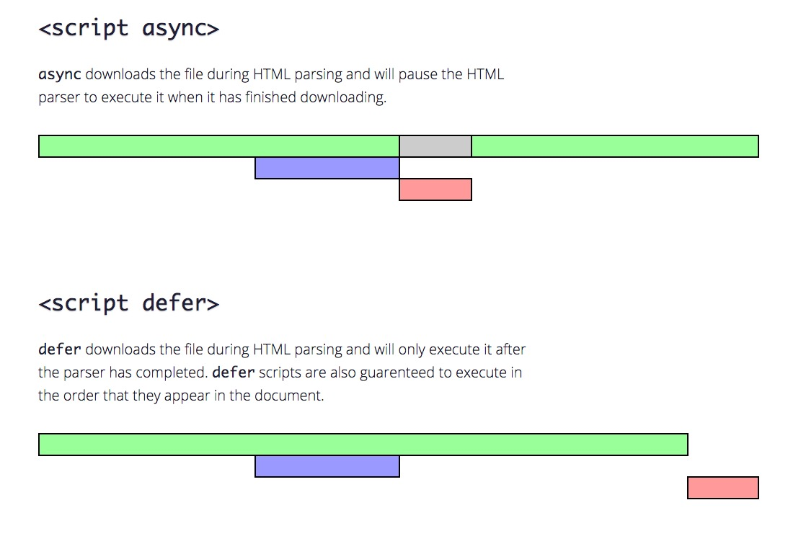
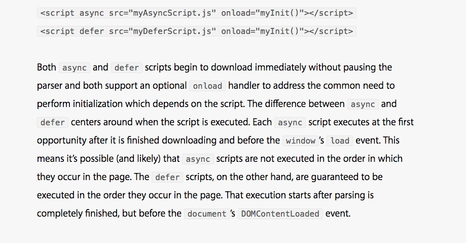
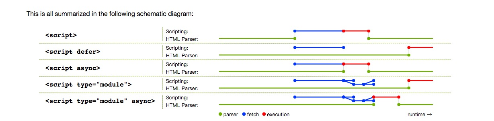

###script的defer和async 注意事项

*  [async vs defer attributes原文链接][1]

*  [Running scripts in WebKit原文链接][2]

*  [attr-script-defer原文链接][3]

[1]: http://www.growingwiththeweb.com/2014/02/async-vs-defer-attributes.html
[2]: https://webkit.org/blog/1395/running-scripts-in-webkit/
[3]: https://html.spec.whatwg.org/multipage/scripting.html#attr-script-defer

具体实践代码可以看[这里](https://github.com/zhenghuahou/node/blob/master/demo13/readme.md)

**其他参考网站:**
 * [script的defer和async](http://ued.ctrip.com/blog/script-defer-and-async.html)
 * [MDN script](https://developer.mozilla.org/en-US/docs/Web/HTML/Element/script)